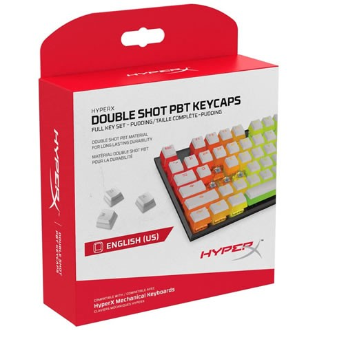

<!DOCTYPE html>
<html>
<head>
    <meta charset="utf-8" />
    <meta http-equiv="X-UA-Compatible" content="IE=edge">
    <meta name="viewport" content="width=device-width, initial-scale=1">
    <title>Gameshop</title>
    <link href="css/bootstrap.min.css" rel="stylesheet" />
    <link href="css/General.css" rel="stylesheet" />
    <link rel="stylesheet" href="https://cdnjs.cloudflare.com/ajax/libs/font-awesome/4.7.0/css/font-awesome.min.css">
    <link rel="stylesheet" href="css/font-awesome.min.css">
</head>
<body>

    

        <!-- Area del header -->
        

            

                

                    

                        <h1></h1>

                    

                

                

                    

                        <a href="cart.html">Cart - $100 <i class="fa fa-shopping-cart"></i> </a>
                    

                

            

        

    
 <!-- Area del header -->

    

        <!-- Area del navigation bar -->
        

            

                

                    <button type="button" class="navbar-toggle" data-toggle="collapse" data-target=".navbar-collapse">
                        Toggle navigation
                        
                        
                        
                    </button>
                

                

                    <ul class="nav navbar-nav">
                        <li><a href="index.html">Home</a></li>
                        <li><a href="shop.html">Shop page</a></li>
                        <li><a href="single-product.html">Single product</a></li>
                        <li><a href="cart.html">Cart</a></li>
                        <li class="active"><a href="checkout.html">Checkout</a></li>
                        <li><a href="#">Category</a></li>
                        <li><a href="#">Others</a></li>
                        <li><a href="#">Contact</a></li>
                    </ul>
                

            

        

    
 <!-- Area del navigation bar -->

    

        <!-- Titulo -->

        

            

                

                    

                        <h2>Checkout</h2>
                    

                

            

        

    
 <!-- Titulo -->

    

        

        

            

                

                    

                        <h2 class="sidebar-title">Search Products</h2>
                        <form action="">
                            <input type="text" placeholder="Search products...">
                            <input type="submit" value="Search">
                        </form>
                    

                    

                        <h2 class="sidebar-title">Products</h2>
                        

                            
                            <h2><a href="">PBT KEYCAPS</a></h2>
                            

                                <ins>$299.00</ins> <del>$199.00</del>
                            

                        

                        

                            
                            <h2><a href="">NOBLECHAIRS EPIC</a></h2>
                            

                                <ins>$350</ins> <del>$255.00</del>
                            

                        

                        

                            
                            <h2><a href="">RAZER NAGA PRO</a></h2>
                            

                                <ins>$250</ins> <del>$199.00</del>
                            

                        

                    

                    

                        <h2 class="sidebar-title">Recent Posts</h2>
                        <ul>
                            <li><a href="">LOGITECH G502</a></li>
                            <li><a href="">COOLING RGB</a></li>
                            <li><a href="">PURE BASE 500DX</a></li>
                        </ul>
                    

                

                

                    

                        

                            

                                

                                    

                                        <h3>Billing Details</h3>
                                        

                                            <label>Country</label>
                                            <input type="text" placeholder="">
                                        

                                        

                                            <label>First Name</label>
                                            <input type="text" placeholder="">
                                        

                                        

                                            <label>Last Name</label>
                                            <input type="text" placeholder="">
                                        

                                        

                                            <label>Company Name</label>
                                            <input type="text" placeholder="">
                                        

                                        

                                            <label>Address</label>
                                            <input type="text" placeholder="">
                                        

                                        

                                            <input type="text" placeholder="">
                                        

                                        

                                            <label>Town / City</label>
                                            <input type="text" placeholder="">
                                        

                                        

                                            <label>County</label>
                                            <input type="text" placeholder="">
                                        

                                    

                                

                                

                                    

                                        <h3>Ship to a different address?</h3>
                                        

                                            <label>Country</label>
                                            <input type="text" placeholder="">
                                        

                                        

                                            <label>First Name</label>
                                            <input type="text" placeholder="">
                                        

                                        

                                            <label>Last Name</label>
                                            <input type="text" placeholder="">
                                        

                                        

                                            <label>Company Name</label>
                                            <input type="text" placeholder="">
                                        

                                        

                                            <label>Address</label>
                                            <input type="text" placeholder="">
                                        

                                        

                                            <input type="text" placeholder="">
                                        

                                        

                                            <label>Town / City</label>
                                            <input type="text" placeholder="">
                                        

                                        

                                            <label>County</label>
                                            <input type="text" placeholder="">
                                        

                                    

                                

                            

                        

                    

                

            

        

    

    

        <!-- Footer  Area -->
        

        

            

                

                    

                        <h2>Gamerz</h2>
                        
Lorem ipsum dolor sit amet, consectetur adipisicing elit. Perferendis sunt id doloribus vero quam laborum quas alias dolores blanditiis iusto consequatur, modi aliquid eveniet eligendi iure eaque ipsam iste, pariatur omnis sint! Suscipit, debitis, quisquam. Laborum commodi veritatis magni at?

                        

                            <a href="#"><i class="fa fa-facebook"></i></a>
                            <a href="#"><i class="fa fa-twitter"></i></a>
                            <a href="#"><i class="fa fa-youtube"></i></a>
                            <a href="#"><i class="fa fa-linkedin"></i></a>
                        

                    

                

                

                    

                        <h2 class="footer-wid-title">User Navigation </h2>
                        <ul>
                            <li><a href="#">My account</a></li>
                            <li><a href="#">Order history</a></li>
                            <li><a href="#">Wishlist</a></li>
                            <li><a href="#">Vendor contact</a></li>
                            <li><a href="#">Front page</a></li>
                        </ul>
                    

                

                

                    

                        <h2 class="footer-wid-title">Categories</h2>
                        <ul>
                            <li><a href="#">Keyboards</a></li>
                            <li><a href="#">PC Cases</a></li>
                            <li><a href="#">Headsets</a></li>
                            <li><a href="#">Computers</a></li>
                            <li><a href="#">Gaming Mouse</a></li>
                        </ul>
                    

                

                

                    

                        <h2 class="footer-wid-title">Newsletter</h2>
                        
Sign up to our newsletter and get exclusive deals you wont find anywhere else straight to your inbox!

                        

                            <form action="#">
                                <input type="email" placeholder="Type your email">
                                <input type="submit" value="Subscribe">
                            </form>
                        

                    

                

            

        

    
 <!-- Footer  Area -->

</body>
</html>